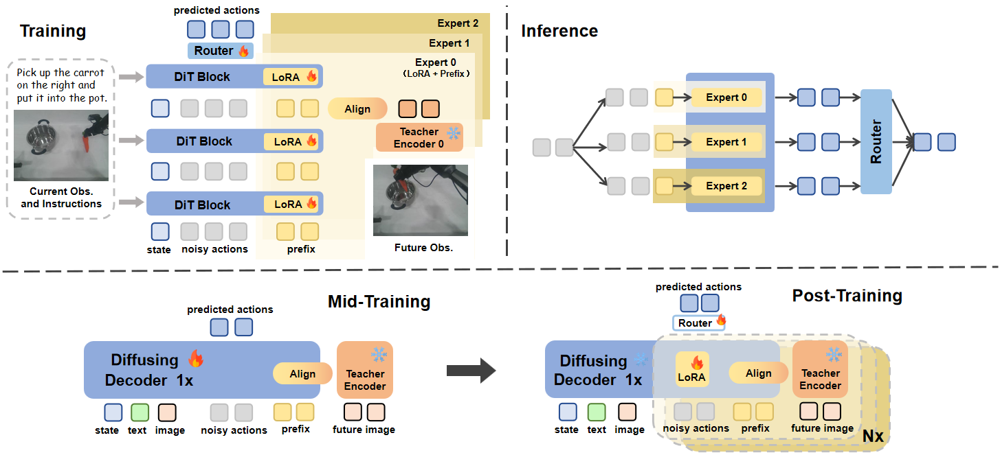

# Infusing World Modeling into Generalist Policies via Multiple Future Representation Alignment
<div align="center">

[]() []() []() 

</div>

## :loudspeaker: News!
- **[2026/2/xx]** We released our paper on [ArXiv]().

## 📃 Overview


## 🚀 Get Started


## 🔥 TODO List
✅ Training and inference code on RoboTwin2.0 ([tutorial](./robotwin.md))<br>


## 🌏 Contact
For further discussion and collaboration, please feel free to contact us via Email and WeChat:

| Author | Email | WeChat |
|:---:|:---:|:---:|
| Han Zhao |  |  |
| Jingbo Wang | guangtouchangkaishen@outlook.com | guangtouchangkaishen |
| Wenxuan Song | songwenxuan0115@gmail.com | swx0757 |


## ❤️ Acknowledgement
We thank these great works and open-source codebases: [RDT](https://github.com/thu-ml/RoboticsDiffusionTransformer) & [Theia](https://github.com/bdaiinstitute/theia)


## 🖊 Citation
If you find this work useful, please cite:

```bibtex

```